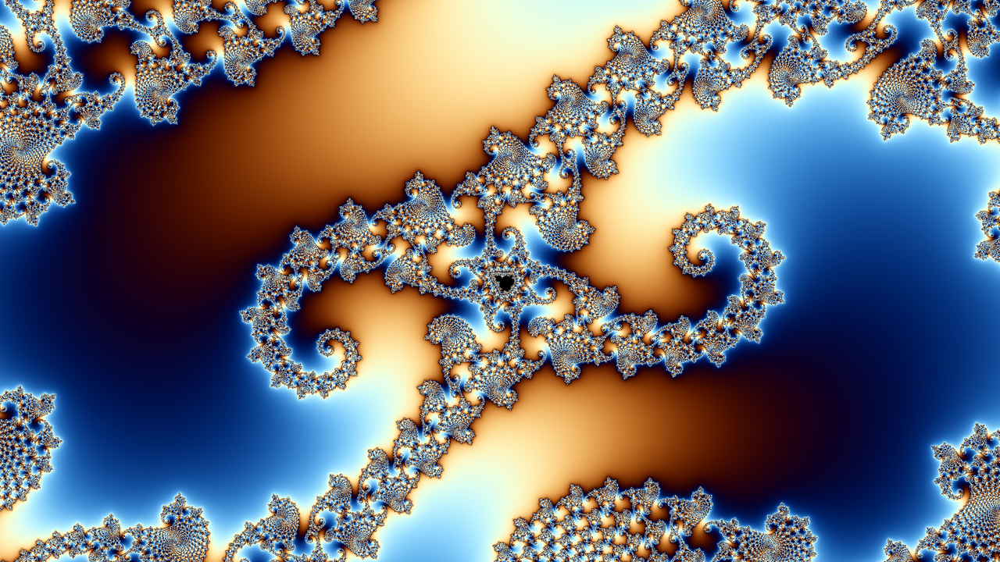
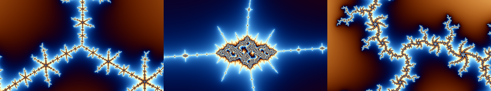

# mandelzoom

An endless Mandelbrot zoom for your terminal. Leave it running as a screensaver.





In terminals that support the [kitty graphics protocol](https://sw.kovidgoyal.net/kitty/graphics-protocol/)
(kitty, Ghostty) it draws real pixels at full window resolution. Everywhere
else it falls back to 24-bit color half-block characters with 2×2
anti-aliasing. It picks the right mode on its own.

The images above are frames rendered with mandelzoom's own drawing code.

## Build

You need a C compiler and `make`. OpenMP is optional but spreads the work
across all your CPU cores.

```sh
make
make install PREFIX=$HOME/.local   # or: sudo make install  (to /usr/local)
```

`make uninstall` (with the same `PREFIX`) removes it again.

Without OpenMP (for example Apple's clang), build with `make OPENMP=`. It
still works, on one core.

The default build is tuned for the machine it's built on (`-march=native`).
Set `CFLAGS` to override that, for example when packaging. `DESTDIR` is
supported too.

## Usage

```sh
mandelzoom
```

Press any key to quit.

| Option | What it does |
|---|---|
| `-s ZOOM` | Zoom factor per frame, 0.9–0.999 (default `0.985`). Higher is slower. |
| `-f FPS` | Target frame rate (default `30`). |
| `-r N` | Fixed render downscale in graphics mode; `1` is full resolution. By default it adapts to hold the frame rate. |
| `-b` | Force half-block mode even if the terminal can show images. |
| `-v` | Print the mode, resolution, and frame rate on exit. |
| `-V` | Print the version and exit. |

## How it works

- **Where it zooms:** it dives into a handful of known-interesting points.
  It moves on to the next one when the view reaches the limit of
  double-precision math (about 10¹² magnification) or turns into a single
  flat color. Colors drift slowly as it goes.
- **Graphics mode:** at startup it asks the terminal whether it can load
  images from shared memory or a temp file. If so, it hands each frame over
  that way instead of piping pixels through the terminal. It waits for the
  terminal to confirm each frame before sending the next.
- **Adaptive resolution:** deep zooms take more math per pixel. When frames
  run long it renders at a lower resolution and lets the terminal scale the
  image up smoothly. When there's spare time it sharpens again.
- **Fallback:** terminals that don't answer the image query, such as
  Alacritty, get the half-block mode. That includes terminals that answer
  yes but then reject the frames.

## Terminal support

| Terminal | Mode |
|---|---|
| kitty | Real pixels (shared memory) |
| Ghostty | Real pixels (shared memory) |
| Alacritty and others | Half-blocks; needs 24-bit color |

Tested on Linux. Tested on MacOS as well, with the build flag of without OpenMP, `make OPENMP=`. 

## License

[MIT](LICENSE)
